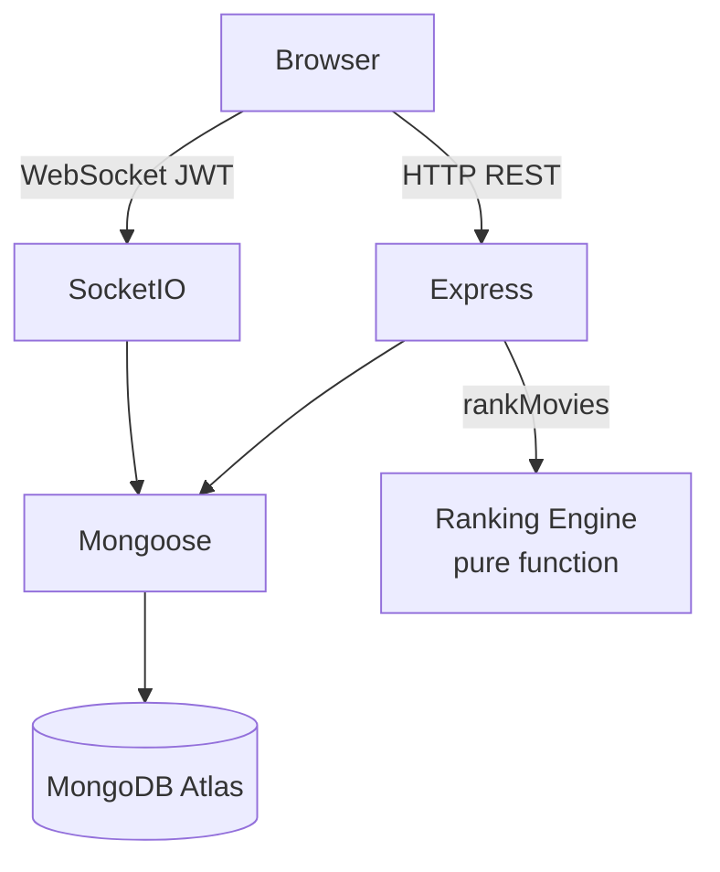
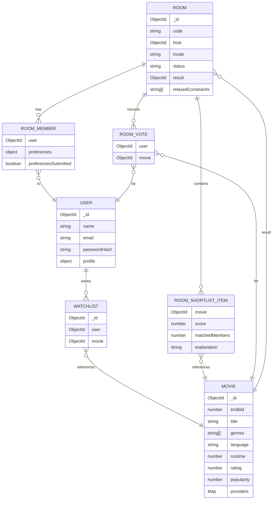

# 🎬 Movie Mystery

> **Stop arguing about what to watch. Start watching.**

Movie Mystery is a group movie-night decider. Members join a room, submit their streaming platforms and genre preferences, and a ranking engine finds the best match for the whole group. Everyone votes live, and the winner is revealed — optionally through a suspenseful mystery reveal where the title stays hidden until the host drops it.

---

## Problem & Solution

**Problem:** Picking a movie for a group is a social coordination nightmare. People have different tastes, different streaming subscriptions, and no one wants to spend 30 minutes scrolling.

**Solution:** A structured flow — preferences → ranked shortlist → live vote → reveal — that respects everyone's constraints and makes the decision feel like an event rather than a chore.

---

## Features

- 🏠 **Rooms** — 6-character invite codes, lobby → preferences → voting → revealed state machine (members can join until voting starts)
- 🤖 **Ranking engine** — weighted scoring (genre overlap, rating, popularity, fairness), hard constraints (platform, runtime, rating, language), automatic fallback relaxation
- 🎭 **Mystery mode** — server-enforced: title and poster hidden until reveal; only genre/decade/runtime/rating-band clues shown
- 📡 **Real-time** — Socket.io with JWT auth; member-joined, vote-cast, result-revealed events; state snapshot on reconnect
- 📺 **Streaming filter** — only recommends movies available on platforms the group shares
- 🗳️ **Live voting** — one vote per member, updatable; tie-break by engine score
- 📜 **Room history** — "What we watched" archive
- 🔍 **Movie explorer** — full-text search, genre/platform/year/rating filters, pagination

---

## Tech Stack

| Layer | Technology |
|---|---|
| Frontend | React 19, Vite, Tailwind CSS v4 |
| Backend | Node.js, Express 4 |
| Database | MongoDB (Mongoose 8) |
| Real-time | Socket.io 4 |
| Auth | JWT (jsonwebtoken) |
| Validation | Joi |
| Testing | Jest, Supertest, mongodb-memory-server |
| API Docs | Swagger UI (swagger-jsdoc) |
| Deployment | Vercel (client), Render (server), MongoDB Atlas |

---

## Architecture



---

## Database Schema



---

## API Reference

| Method | Endpoint | Auth | Description |
|---|---|---|---|
| GET | /api/health | — | Health check |
| POST | /api/auth/register | — | Register |
| POST | /api/auth/login | — | Login |
| GET | /api/auth/me | ✓ | Current user |
| PATCH | /api/users/profile | ✓ | Update region/platforms/languages |
| GET | /api/movies | — | List/search movies |
| GET | /api/movies/:id | — | Movie detail |
| GET | /api/movies/meta/filters | — | Available filter options |
| POST | /api/watchlist/:movieId | ✓ | Add to watchlist |
| DELETE | /api/watchlist/:movieId | ✓ | Remove from watchlist |
| GET | /api/watchlist | ✓ | Get watchlist |
| POST | /api/rooms | ✓ | Create room |
| POST | /api/rooms/join | ✓ | Join room by code |
| GET | /api/rooms/history | ✓ | Past revealed rooms |
| GET | /api/rooms/:code | ✓ | Room state (mystery-filtered) |
| PUT | /api/rooms/:code/preferences | ✓ | Submit preferences |
| POST | /api/rooms/:code/start-voting | ✓ host | Run engine, move to voting |
| POST | /api/rooms/:code/vote | ✓ | Cast/update vote |
| POST | /api/rooms/:code/reveal | ✓ host | Tally, reveal winner |

Interactive docs: `http://localhost:5000/api/docs`

---

## Ranking Algorithm

See [`docs/ranking-algorithm.md`](docs/ranking-algorithm.md) for the full write-up.

**Summary:**
1. **DB pre-filter** — loose query: the 1,000 most popular movies (hard constraints and relaxation are applied by the engine, not the DB)
2. **Hard constraints** — platform ∩ all members, min(maxRuntime), max(minRating), language union (O(C×M))
3. **Fallback relaxation** — relax maxRuntime → minRating → language → platform until ≥10 results
4. **Mood expansion** — map mood → genres before scoring
5. **Soft scoring** — `0.40×genreOverlap + 0.25×rating + 0.20×popularity + 0.15×fairness`
6. **Sort & slice** — top 10, tie-break by tmdbId for determinism

**Total complexity: O(C×M + C log C)** where C ≤ 300, M ≤ ~20.

---

## Local Setup (< 5 minutes)

### Prerequisites
- Node.js 18+, MongoDB running locally (or Atlas URI)
- TMDB API key is **optional** for local dev — the seed script includes a static bundle of 30 movies that works out of the box. Get a free key at [themoviedb.org](https://www.themoviedb.org/) for richer data.

### Server
```bash
cd server
cp .env.example .env        # fill in MONGO_URI and JWT_SECRET (TMDB key optional)
npm install
npm run seed                # loads 30 movies instantly (no API key needed)
                            # with TMDB_API_KEY set, also pulls ~5,000 popular movies (SEED_TARGET)
npm run sync -- --target=30000   # optional: big catalogue (see below)
npm run dev                 # http://localhost:5000
# API docs: http://localhost:5000/api/docs
```

### Client
```bash
cd client
cp .env.example .env        # VITE_API_URL=/api (default works with proxy)
npm install
npm run dev                 # http://localhost:5173
```

### Environment Variables

**Server (`server/.env`)**
```
PORT=5000
MONGO_URI=mongodb://127.0.0.1:27017/movie_mystery
JWT_SECRET=<random 32+ char string>
TMDB_API_KEY=<optional — for live sync only>
CLIENT_ORIGIN=http://localhost:5173
STALE_DAYS=7
```

**Client (`client/.env`)**
```
VITE_API_URL=/api
```

---

## Growing the movie catalogue

`npm run sync` builds a large, quality-filtered catalogue from TMDB `/discover/movie`, one release year at a time (newest first), so TMDB's 10,000-results-per-query cap never applies.

```bash
npm run sync -- --target=30000 --min-votes=100 --from=1960
```

| Option | Default | Meaning |
|---|---|---|
| `--target` | 30000 | stop after this many movies |
| `--min-votes` | 100 | skip obscure titles (TMDB `vote_count.gte`) |
| `--from` / `--to` | 1960 / current year | release-year range |
| `--no-details` | off | list data only (fast, but no runtime/cast/providers) |

- One API call per movie (details, cast, trailer and providers come from a single `append_to_response` request), about 30 requests/s: roughly 17 minutes per 30,000 movies.
- Safe to stop and re-run: movies that are complete and fresher than `STALE_DAYS` are skipped.
- Streaming providers are stored for IN, US, GB, AU, CA only, to keep documents small. The free MongoDB Atlas tier (512 MB) fits roughly 100k movies, so 30k leaves plenty of room.

## Testing

```bash
cd server
npm test                    # all 73 tests
npm test -- --coverage      # with coverage report
```

**Coverage (v1.0):**
- Statements: 71%
- Lines: 76%
- Functions: 64%
- Branches: 44%

Key test files:
- `tests/rankingEngine.test.js` — 15 pure unit tests (unanimous, conflicting, fallback, mood, determinism, edge cases)
- `tests/rooms.test.js` — 20 integration tests (vote rules, host-only, tie-break, mystery hiding, history)
- `tests/auth.test.js`, `movies.test.js`, `watchlist.test.js`, `health.test.js`

---

## Screenshots

> _Add screenshots here_

| Landing | Lobby | Voting | Reveal |
|---|---|---|---|
|  |  |  |  |

> _Demo GIF placeholder_ — `docs/demo.gif`

---

## Deployment

### MongoDB Atlas
1. Create a free M0 cluster at [cloud.mongodb.com](https://cloud.mongodb.com)
2. Add a database user and whitelist `0.0.0.0/0` (or Render's IP range)
3. Copy the connection string → `MONGO_URI`

### Backend — Render
1. Push repo to GitHub
2. New Web Service → connect repo → Root Directory: `server`
3. Build: `npm install` · Start: `npm start`
4. Set env vars: `MONGO_URI`, `JWT_SECRET`, `TMDB_API_KEY`, `CLIENT_ORIGIN`, `NODE_ENV=production`
5. Note the service URL (e.g. `https://movie-mystery-api.onrender.com`)

### Frontend — Vercel
1. New Project → import repo → Root Directory: `client`
2. Framework: Vite (auto-detected)
3. Set env var: `VITE_API_URL=https://movie-mystery-api.onrender.com/api`
4. Deploy → note the URL → paste into Render's `CLIENT_ORIGIN`

### Socket.io in production
The client socket connects to `VITE_API_URL` with the `/api` suffix stripped. In `useSocket.js`:
```js
const SOCKET_URL = import.meta.env.VITE_API_URL?.replace('/api', '') ?? '';
```
Render's free tier supports WebSockets. No extra config needed.

---

## Future Improvements

- **ML recommendations** — replace the weighted scoring with a collaborative-filter model trained on room history
- **Watch-party sync** — integrate with Teleparty/Scener API so the group can watch together after the reveal
- **WhatsApp / Telegram invite** — one-tap share link that deep-links into the app
- **Ranked-choice voting** — let members rank all 10 shortlist items; use instant-runoff for the winner
- **Progressive Web App** — offline lobby, push notifications when the host starts voting

---

## Project Structure

```
/
├── client/          Vite + React frontend
│   └── src/
│       ├── components/   Shared UI (PageShell, Spinner, EmptyState, Toast)
│       ├── context/      Auth, Watchlist, Toast
│       ├── hooks/        useSocket, useDebounce
│       ├── pages/        All route pages
│       └── services/     API clients
├── server/          Express + Mongoose backend
│   ├── config/       DB connection
│   ├── controllers/  Route handlers
│   ├── docs/         Swagger spec
│   ├── middleware/   Auth, error handler
│   ├── models/       Mongoose schemas
│   ├── routes/       Express routers
│   ├── services/     rankingEngine, socketService, authService, …
│   ├── tests/        Jest test suites
│   ├── utils/        ApiError, asyncHandler, jwt
│   └── validators/   Joi schemas
└── docs/            Algorithm documentation
```
